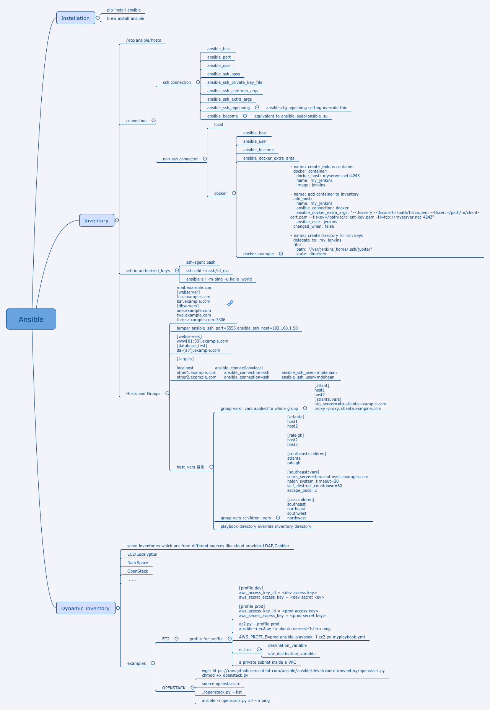

## Ansible 介绍

Ansible可以用来帮助IT自动化，关于ansible的一点说明:
```
Ansible is a radically simple IT automation platform that makes your applications and systems easier to deploy and maintain. Automate everything from code deployment to network configuration to cloud management, in a language that approaches plain English, using SSH, with no agents to install on remote systems. https://docs.ansible.com.
```

### Installation- 安装

在MAC 上面安装ansible有两种方式：

* python pip

```shell
pip install ansible
```

* brew
```shell
brew install ansible
```

- install in centos

```sh
sudo yum install epel-release
sudo yum install ansible -y
```

### ansible playbook 的简单使用

ansible的大的框架先跳过，我们通过例子来说明ansible的使用。

下面简单介绍一个使用ansible的例子：

- 配置hosts文件
  在当前目录创建一个hosts文件：

  ```shell
    [jenkins]
    192.168.3.50
  ```
- 配置ansible yml playbook文件
  配置当前一个yml文件:

  ```shell
  - hosts: jenkins
    user: root
    accelerate:true
    tasks:
      - name: restart_nginx
        shell: sh /root/auto_publish_qadoc.sh
  ```

- 运行命令

  ```shell
    ansible-playbook playbook.yml -i hosts -vv
  ```

  就可以运行这些命令了,最简单的ansible就是这样上手非常容易.
  不过仔细看看他的帮助文档的话，其实对于python不熟的人还是会有一定难度，不过如果写过程序的人，写过python东西的人来说，其实
  过一下这个document估计也就是1天时间就可以上手干活了.


####  Ansible Basic Concept 基本概念

ansible 是一个操作机器的工具,可以通过编排不同的inventory,组合不同的命令来将日常运维的操作
变成可运行的脚本资产,同时也可以积累常用的脚本以便复用.

下面是关于ansible的一些基础概念的脑图,总体而言ansible包括了以下几个概念：

- inventory: 定义主机,定义操作对象
  * Host:主机
  * Group：不同的主机组合成一个组，一个组下面可以有子组，于是就构成了一个树形结构
- variable： 变量，主要用来定义对于操作机器时使用的可变参数

#### Configure hosts for ansible ssh connector

- copy ssh key to different hosts
```sh
ssh-keygen
ssh-copy-id remoteuser@remote.server
ssh-keyscan remote.server >> ~/.ssh/known_hosts
```
- check ssh connection
```sh
ssh remoteuser@remote.server
```

Done.

##### Ansible Ad-hoc Commands

ansible 命令的pattern 如下：

```sh
ansible <host-pattern> [options]
```
具体查看ansible 的使用帮助是：
```sh
ansible --help
```

##### ansible ad-hoc command - 检查安装环境

```sh
ansible all -m ping -u root
```

##### ansible ad-hoc command - 执行命令

```sh
ansible all -a "/bin/sh echo hello world"
```

##### ansible ad-hoc command - copy files

```sh
ansible web -m copy -a "src=/etc/hosts dest=/tmp/hosts"
```

##### ansible ad-hoc command - yum install 

```sh
ansible web -m yum -a "name=acme state=present"
```

##### ansible ad-hoc command - add user

```sh
ansible all -m user -a "name=foo passsword=<crypted password here>"
```

##### ansible ad-hoc command - download git 包

```sh
ansible web -m git -a "repo=git://foo.example.io/repo.git dest=/src/myapp"
```

##### ansible ad-hoc command - start service 

```sh
ansible web -m service -a "name=httpd state=started"
```

##### ansible ad-hoc command - 并行运行

```sh
ansible web -a "/sbin/reboot" -f 10
```

##### ansible ad-hoc command - 查看全部系统信息

```sh
ansible all -m setup
```

##### ansible ad-hoc command 小结

从以上的例子中我们可以看到ansible的命令一般都会使用如下几点：

- module: -m 
- module_args: -a 
- hosts: all/web/......

以上三个组合成为了下面的一个命令：

```sh
ansible all -m service -a "name=httpd state=started"
```

从python的角度看,可以用伪代码的方式:

```sh

def copy(args={}):
    for kwarg, v in args.items():
        print("{key}={value}".format(key=kwarg, value=v))


def test(args={}):
    for kwarg, v in args.items():
        print("{key}={value}".format(key=kwarg, value=v))


module_mapping = {
    "copy": copy,
    "test": test
}


def ansible(module, module_args):
    func = module_mapping.get(module)
    parsed = module_args.split(" ")
    args = {}
    for module_arg in parsed:
        kv = module_arg.split("=")
        args[kv[0]] = kv[1]
    func(args)
if __name__ == '__main__':
    ansible(module='copy', module_args="name=name test=test")
```

##### mindmap of ansible

Ansible 脑图:




### Ansible modules使用介绍

写一个Ansbile Module实际上非常容易，我从看
```https://github.com/SeleniumHQ/ansible-selenium.git``` 这个源码的方式大概可以了解Ansible的一个简单的
插件.

下面分几个内容来看：

- 插件运行代码
- 插件的meta的数据

### Ansible 插件代码

- 首先Ansible 插件的入口函数为main函数

所以先定义一个main函数，以及main函数的运行

```python
def main():
  pass

main()

```

- 实现main函数

主要步骤是：

- module定义，Ansible的module，定义这个AnsibleModule的argument_spec,这个里面用来声明这个插件使用的参数
- module.params，ansible的输入为task的yml文件，这里面定义的内容都会传递到这个params中
- 然后根据不同的state的值去调用不同的任务，所有不同的任务的参数都是module，module用来传递了运行时的上下文
- 实现不同state对应的任务
- 基本上就结束了一个Ansible插件了

```python
    module = AnsibleModule(
        argument_spec=dict(
            role=dict(choices=['standalone', 'hub', 'node'], default='standalone'),
            state=dict(choices=['running', 'stopped', 'restarted'], default='running'),
            version=dict(default='2.53.0'),
            path=dict(default='.'),
            force=dict(default=False, type='bool'),
            args=dict(required=False, default=''),
            java=dict(required=False, default='/usr/bin/java'),
            logfile=dict(required=False, default='./selenium.log'),
            javaargs=dict(required=False, default=[], type='list'),
        ),

        supports_check_mode=False,

        mutually_exclusive=[]
    )

    state = module.params['state']
    role = module.params['role']

    if state == 'running':
        (changed, pid) = start(module)
        finish(module, msg='%s is running' % role, changed=changed, pid=pid)
    elif state == 'stopped':
        changed = stop(module)
        finish(module, msg='%s is stopped' % role, changed=changed)
    elif state == 'restarted':
        (changed, pid) = restart(module)
        finish(module, msg='%s has restarted' % role, changed=changed, pid=pid)
```

start 任务的一个例子：

```python
def start(module):
    """
    Start the Selenium standalone
    :param module:
    :return:
    """

    _, jar_file = download(module)

    changed = False
    role = module.params['role']
    if role != 'standalone':
      role = "-role %s" % role
    else: 
      role = ''

    if not is_running(module): # in another implementation
        changed = True
        args = ''
        java_args = ''
        if module.params['args']:
            for (k, v) in module.params['args'].iteritems():
                args += '-%s=%s ' % (k, v)

        if module.params['javaargs']:
            for arg in module.params['javaargs']:
                java_args += '-%s ' % arg

        java_executable = os.path.abspath(os.path.expandvars(module.params['java']))
        log_file = os.path.abspath(os.path.expandvars(module.params['logfile']))

        cmd = "%s %s -jar %s %s %s >> %s 2>&1 &" % (java_executable,
                                                          java_args,
                                                          jar_file,
                                                          role,
                                                          args,
                                                          log_file)

        os.setsid()

        #print cmd
        rc = os.system(cmd)

        if rc != 0:
            abort(module, 'Running the %s role returned code %s !' % (role, rc))

    pid = get_pid(module)
    if pid:
        return changed, pid
    else:
        abort(module, 'Couldnt fetch the pid of the running %s ! It may have ended abruptly.' % module.params['role'])

```

### Meta 插件的meta的数据

meta信息一般存放在meta目录中，具体写的方式参考源码:
- ```https://github.com/SeleniumHQ/ansible-selenium.git```
